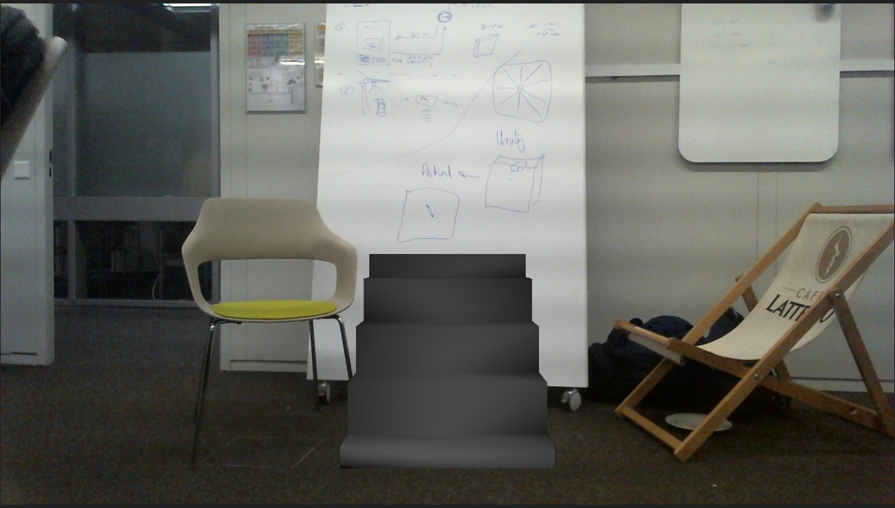
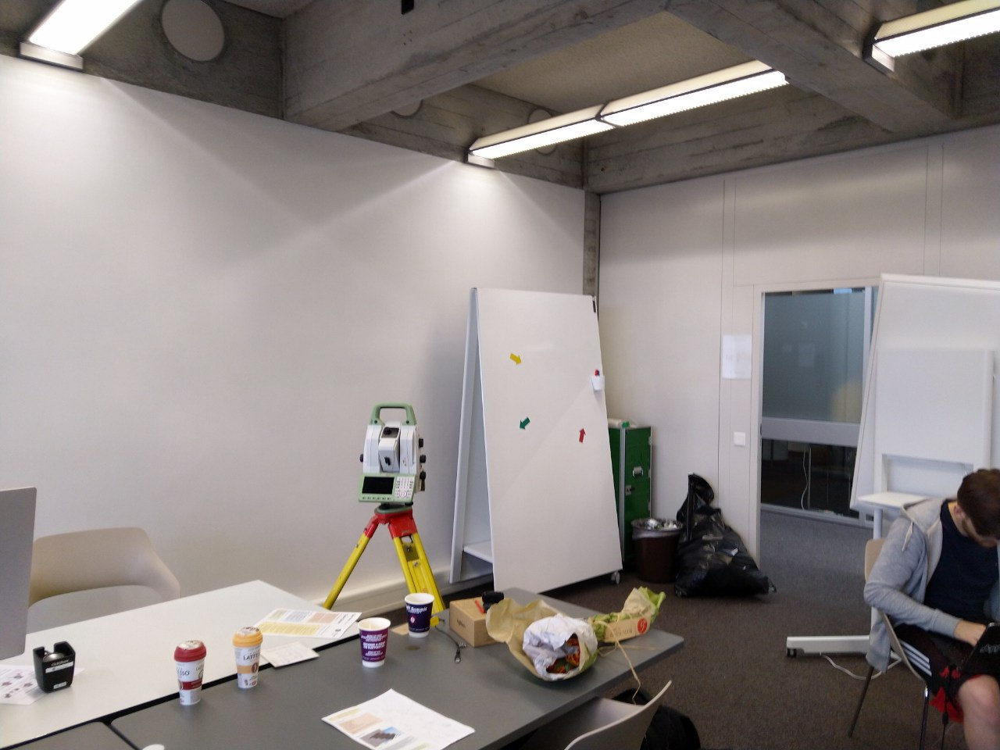
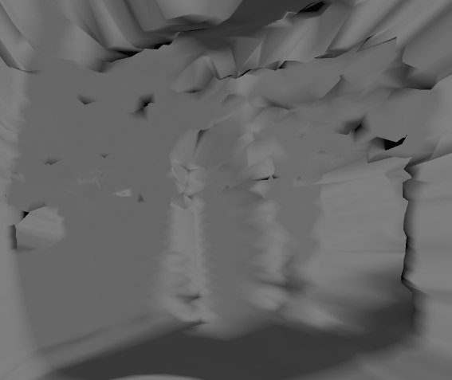

# MadIdeAR

AR for ARchitects.



Project for [START Hack 2019](https://starthack.ch/).

Featuring:
* 3D model of the room in St.Gallen's University scanned with Leica MS60;
* 3D models of furniture, stairs etc that are visualised in the webcam's video stream;
* solution for discovering flaws in architectural plans (e.g. stairs that are too wide and just don't fit).

Real room photo            |  3D model of the room
:-------------------------:|:-------------------------:
  |  

## Usage (python 3.6 environment)

1) Plug in your webcam.
2) Run:
```bash
pip -r install requirements.txt
cd geocom
python main.py
```
3) Open [localhost/video_feed](http://0.0.0.0:2122/video_feed) in your browser.

4) Explore!

## Built by

Madidea Team ( [alexeyqu](https://github.com/alexeyqu), [neganovalexey](https://github.com/neganovalexey), [paulin-mipt](https://github.com/paulin-mipt), [Pitovsky](https://github.com/Pitovsky) )
